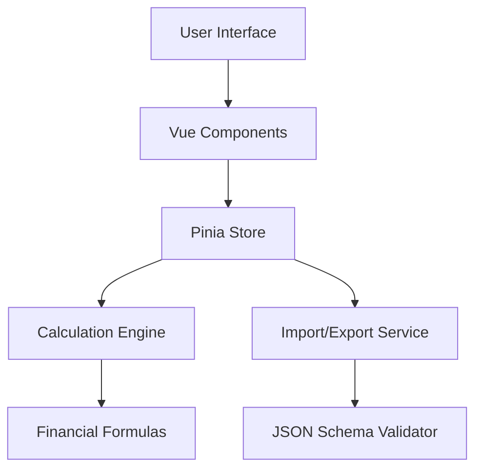

# Design Document

## Overview

The Retirement Calculator MVP is a single-page Vue 3 application that provides users with a simple, intuitive interface for retirement planning calculations. The application follows a mobile-first, responsive design approach with real-time calculations and data persistence through JSON import/export functionality.

The design emphasizes simplicity and immediate feedback, allowing users to see the impact of their financial decisions instantly. The application will be built using Vue 3 with TypeScript, Tailwind CSS for styling, and Pinia for state management.

## Architecture

### High-Level Architecture



### Technology Stack
- **Frontend**: Vue 3 with Composition API and TypeScript
- **Build Tool**: Vite for fast development and optimized builds
- **Styling**: Tailwind CSS for utility-first responsive design
- **State Management**: Pinia for reactive state management
- **Validation**: Custom validators with real-time feedback
- **File Handling**: Browser File API for import/export

### Application Structure
```
src/
├── components/
│   ├── inputs/
│   │   ├── NumberInput.vue
│   │   └── PercentageInput.vue
│   ├── results/
│   │   ├── ResultsCard.vue
│   │   └── ResultsBreakdown.vue
│   └── layout/
│       ├── AppHeader.vue
│       └── AppFooter.vue
├── stores/
│   └── retirement.ts
├── utils/
│   ├── calculations.ts
│   ├── validators.ts
│   ├── formatters.ts
│   └── fileHandlers.ts
├── types/
│   └── retirement.ts
└── views/
    └── Calculator.vue
```

## Components and Interfaces

### Core Components

#### 1. Calculator View (Main Container)
- **Purpose**: Main application container that orchestrates all components
- **Responsibilities**: Layout management, responsive behavior, component coordination
- **Props**: None (root component)
- **Emits**: None

#### 2. NumberInput Component
- **Purpose**: Reusable input component for numeric values with validation
- **Props**: 
  - `modelValue: number`
  - `label: string`
  - `placeholder?: string`
  - `min?: number`
  - `max?: number`
  - `step?: number`
- **Emits**: `update:modelValue`
- **Features**: Real-time validation, error display, currency formatting

#### 3. PercentageInput Component
- **Purpose**: Specialized input for percentage values
- **Props**: 
  - `modelValue: number`
  - `label: string`
  - `placeholder?: string`
- **Emits**: `update:modelValue`
- **Features**: Automatic percentage symbol, decimal validation

#### 4. ResultsCard Component
- **Purpose**: Display calculated retirement projections
- **Props**: 
  - `results: CalculationResults`
- **Features**: Formatted currency display, inflation-adjusted values, visual hierarchy

#### 5. ResultsBreakdown Component
- **Purpose**: Detailed breakdown of contributions vs growth
- **Props**: 
  - `totalContributions: number`
  - `investmentGrowth: number`
  - `inflationAdjustedValue: number`
- **Features**: Visual representation of value composition

### State Management (Pinia Store)

#### Retirement Store
```typescript
interface RetirementState {
  // Input values
  currentAge: number;
  retirementAge: number;
  currentSavings: number;
  monthlyContribution: number;
  expectedReturnRate: number;
  inflationRate: number;
  
  // Calculated results
  results: CalculationResults | null;
  
  // UI state
  isCalculating: boolean;
  errors: Record<string, string>;
}

interface CalculationResults {
  futureValue: number;
  totalContributions: number;
  investmentGrowth: number;
  inflationAdjustedValue: number;
  yearsToRetirement: number;
  monthsToRetirement: number;
}
```

#### Store Actions
- `updateInput(field: string, value: number)`: Update input values and trigger recalculation
- `calculateRetirement()`: Perform retirement calculations
- `exportData()`: Generate JSON export
- `importData(data: RetirementData)`: Import and validate JSON data
- `resetCalculator()`: Reset all values to defaults

## Data Models

### Primary Data Interfaces

```typescript
// Main data structure for import/export
interface RetirementData {
  version: string;
  exportDate: string;
  user: UserInputs;
}

// User input data
interface UserInputs {
  currentAge: number;
  retirementAge: number;
  currentSavings: number;
  monthlyContribution: number;
  expectedReturnRate: number;
  inflationRate: number;
}

// Validation rules
interface ValidationRule {
  field: string;
  min?: number;
  max?: number;
  required: boolean;
  customValidator?: (value: number) => boolean;
}
```

### Calculation Engine

#### Core Financial Formulas
1. **Future Value Calculation**:
   ```typescript
   FV = PV × (1 + r)^n + PMT × [((1 + r)^n - 1) / r]
   ```
   Where:
   - PV = Present Value (current savings)
   - r = Monthly return rate
   - n = Number of months
   - PMT = Monthly payment

2. **Inflation Adjustment**:
   ```typescript
   Real Value = Nominal Value / (1 + inflation_rate)^years
   ```

3. **Total Contributions**:
   ```typescript
   Total = Monthly Contribution × Months to Retirement + Current Savings
   ```

#### Calculation Service
```typescript
class RetirementCalculator {
  static calculateFutureValue(inputs: UserInputs): CalculationResults {
    // Implementation of compound interest calculations
    // Returns all calculated values
  }
  
  static validateInputs(inputs: UserInputs): ValidationErrors {
    // Input validation logic
  }
}
```

## Error Handling

### Input Validation Strategy
1. **Real-time Validation**: Validate inputs as user types (debounced)
2. **Visual Feedback**: Red borders and error messages for invalid inputs
3. **Calculation Blocking**: Prevent calculations with invalid data
4. **User Guidance**: Helpful error messages explaining valid ranges

### Error Types
- **Range Errors**: Values outside acceptable ranges (e.g., negative ages)
- **Logic Errors**: Retirement age less than current age
- **Format Errors**: Non-numeric inputs
- **Import Errors**: Invalid JSON structure or missing fields

### Error Display
```typescript
interface ValidationError {
  field: string;
  message: string;
  type: 'range' | 'logic' | 'format' | 'required';
}
```

## Testing Strategy

### Unit Testing
- **Calculation Engine**: Test all financial formulas with known inputs/outputs
- **Validators**: Test input validation rules
- **Formatters**: Test currency and percentage formatting
- **Store Actions**: Test state mutations and side effects

### Component Testing
- **Input Components**: Test validation, formatting, and event emission
- **Results Components**: Test data display and formatting
- **Integration**: Test component communication and data flow

### End-to-End Testing
- **Complete User Flow**: Input → Calculation → Export → Import
- **Responsive Behavior**: Test on different screen sizes
- **Error Scenarios**: Test invalid inputs and error recovery

### Test Data
```typescript
const testScenarios = [
  {
    name: "Young Professional",
    inputs: { currentAge: 25, retirementAge: 65, currentSavings: 10000, monthlyContribution: 1000, expectedReturnRate: 7, inflationRate: 3 },
    expectedFutureValue: 2847000 // approximate
  },
  {
    name: "Mid-Career",
    inputs: { currentAge: 40, retirementAge: 65, currentSavings: 100000, monthlyContribution: 2000, expectedReturnRate: 6, inflationRate: 2.5 },
    expectedFutureValue: 1650000 // approximate
  }
];
```

## User Interface Design

### Layout Structure
1. **Header**: Application title and import/export controls
2. **Input Section**: Card-based layout with grouped inputs
3. **Results Section**: Prominent display of key calculations
4. **Footer**: Additional information and links

### Responsive Breakpoints
- **Mobile (< 768px)**: Single column, stacked layout
- **Tablet (768px - 1024px)**: Two-column layout with inputs on left
- **Desktop (> 1024px)**: Side-by-side layout with enhanced spacing

### Visual Design Principles
- **Clean Interface**: Minimal distractions, focus on core functionality
- **Clear Hierarchy**: Important results prominently displayed
- **Consistent Spacing**: Tailwind CSS spacing scale for consistency
- **Accessible Colors**: High contrast ratios, colorblind-friendly palette
- **Loading States**: Visual feedback during calculations

### Color Scheme
```css
:root {
  --primary: #3B82F6;      /* Blue for primary actions */
  --success: #10B981;      /* Green for positive results */
  --warning: #F59E0B;      /* Amber for warnings */
  --error: #EF4444;        /* Red for errors */
  --neutral: #6B7280;      /* Gray for secondary text */
}
```

## Performance Considerations

### Optimization Strategies
1. **Debounced Calculations**: Prevent excessive recalculation during typing
2. **Memoized Results**: Cache calculations for identical inputs
3. **Lazy Loading**: Load components only when needed
4. **Bundle Splitting**: Separate vendor and application code

### Performance Targets
- **Initial Load**: < 2 seconds on 3G connection
- **Calculation Response**: < 100ms for input changes
- **Bundle Size**: < 500KB gzipped
- **Lighthouse Score**: > 90 for Performance, Accessibility, Best Practices

## Security and Privacy

### Data Handling
- **No Server Storage**: All data remains client-side
- **Local Processing**: All calculations performed in browser
- **Export Security**: JSON files contain no sensitive metadata
- **Input Sanitization**: Validate and sanitize all user inputs

### Privacy Considerations
- **No Tracking**: No analytics or user behavior tracking
- **No External Requests**: Self-contained application
- **Data Ownership**: Users control their data through export/import