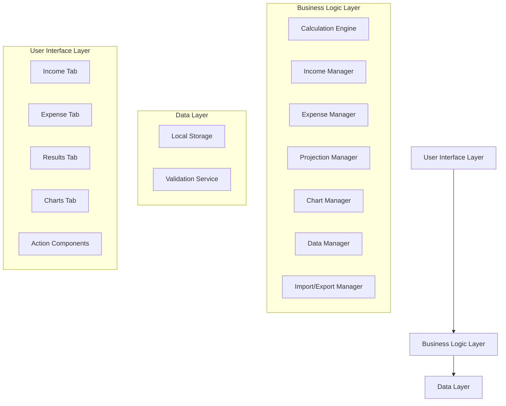

# Design Document

## Overview

The retirement calculator is an advanced client-side web application built as a single-page application (SPA) that performs sophisticated retirement planning calculations with multiple income sources, detailed projections, and comprehensive expense management. The application features granular income modeling, visual charts with monthly breakdowns, and flexible expense tracking. It uses vanilla JavaScript/TypeScript with a modular architecture designed for phased deployment and extensibility. All data is stored locally in the browser using localStorage, with import/export functionality for data portability.

## Architecture

### High-Level Architecture



### Technology Stack

- **Frontend Framework**: Vanilla TypeScript/JavaScript (no framework dependencies)
- **Charting**: Chart.js for interactive charts and visualizations
- **Styling**: CSS3 with CSS Grid/Flexbox for responsive layout and tabbed interface
- **Build Tool**: Vite for development and building
- **Storage**: Browser localStorage API
- **Deployment**: Static files for Cloudflare Pages

## Components and Interfaces

### Core Interfaces

```typescript
interface IncomeSource {
  id: string;
  name: string;
  type: 'regular_job' | 'fixed_period' | 'one_time' | 'rental' | 'investment';
  amount: number;
  frequency: 'monthly' | 'annual' | 'one_time';
  startDate?: Date;
  endDate?: Date;
  annualIncrease?: number;
  contributionPercentage?: number;
  expectedReturn?: number;
}

interface Expense {
  id: string;
  name: string;
  type: 'regular' | 'loan' | 'annual' | 'one_time';
  amount: number;
  frequency: 'monthly' | 'annual' | 'one_time';
  startDate?: Date;
  endDate?: Date;
  inflationAdjusted: boolean;
  loanDetails?: {
    principal: number;
    interestRate: number;
    termYears: number;
  };
}

interface RetirementData {
  currentAge: number;
  retirementAge: number;
  currentSavings: number;
  expectedAnnualReturn: number;
  inflationRate: number;
  monthlyRetirementSpending: number;
  incomeSources: IncomeSource[];
  expenses: Expense[];
  lastUpdated: Date;
}

interface MonthlyProjection {
  month: Date;
  age: number;
  grossIncome: number;
  totalExpenses: number;
  netContribution: number;
  balance: number;
  interestEarned: number;
  isRetired: boolean;
  monthlyWithdrawal?: number;
}

interface CalculationResult {
  totalSavings: number;
  monthlyRetirementIncome: number;
  yearsToRetirement: number;
  totalContributions: number;
  interestEarned: number;
  monthlyProjections: MonthlyProjection[];
  yearlyProjections: MonthlyProjection[];
  netMonthlyIncome: number;
}

interface ExportData {
  version: string;
  exportDate: Date;
  userData: RetirementData;
}
```

### Component Architecture

#### 1. CalculationEngine
- **Purpose**: Core retirement calculation logic with monthly projections
- **Methods**:
  - `calculateMonthlyProjections(data: RetirementData): MonthlyProjection[]`
  - `calculateFutureValue(principal, monthlyPayment, annualRate, years): number`
  - `calculateLoanPayment(principal, rate, term): number`
  - `applyInflation(amount, rate, years): number`
  - `validateInputs(data: RetirementData): ValidationResult`

#### 2. IncomeManager
- **Purpose**: Handle multiple income sources and calculations
- **Methods**:
  - `addIncomeSource(source: IncomeSource): void`
  - `removeIncomeSource(id: string): void`
  - `calculateMonthlyIncome(sources: IncomeSource[], currentDate: Date): number`
  - `validateIncomeSource(source: IncomeSource): ValidationResult`

#### 3. ExpenseManager
- **Purpose**: Handle various expense types and calculations
- **Methods**:
  - `addExpense(expense: Expense): void`
  - `removeExpense(id: string): void`
  - `calculateMonthlyExpenses(expenses: Expense[], currentDate: Date): number`
  - `validateExpense(expense: Expense): ValidationResult`

#### 4. ProjectionManager
- **Purpose**: Generate detailed monthly and yearly projections
- **Methods**:
  - `generateMonthlyProjections(data: RetirementData): MonthlyProjection[]`
  - `generateYearlyProjections(monthlyData: MonthlyProjection[]): MonthlyProjection[]`
  - `calculateRetirementPhase(data: RetirementData, accumulatedSavings: number): MonthlyProjection[]`

#### 5. ChartManager
- **Purpose**: Handle chart generation and data visualization
- **Methods**:
  - `createAccumulationChart(projections: MonthlyProjection[]): Chart`
  - `createWithdrawalChart(projections: MonthlyProjection[]): Chart`
  - `createProjectionTable(projections: MonthlyProjection[]): HTMLElement`
  - `toggleChartView(viewType: 'chart' | 'table'): void`

#### 6. DataManager
- **Purpose**: Handle data persistence and retrieval
- **Methods**:
  - `saveData(data: RetirementData): void`
  - `loadData(): RetirementData | null`
  - `clearData(): void`
  - `migrateData(oldVersion: string, newVersion: string): RetirementData`

#### 7. ImportExportManager
- **Purpose**: Handle data import/export operations
- **Methods**:
  - `exportData(data: RetirementData): void`
  - `importData(file: File): Promise<RetirementData>`
  - `validateImportData(data: any): boolean`

#### 8. UIController
- **Purpose**: Coordinate between UI components and business logic
- **Methods**:
  - `updateCalculations(): void`
  - `handleIncomeChange(sources: IncomeSource[]): void`
  - `handleExpenseChange(expenses: Expense[]): void`
  - `displayResults(results: CalculationResult): void`
  - `switchTab(tabName: string): void`

## Data Models

### RetirementData Model
- Stores all user input data including multiple income sources and expenses
- Includes validation rules for each field type
- Tracks last update timestamp
- Supports data migration between versions

### IncomeSource Model
- Supports multiple income types with different calculation methods
- Handles time-based income (start/end dates)
- Includes contribution percentages for retirement savings
- Validates based on income type

### Expense Model
- Supports various expense types including loans
- Handles recurring and one-time expenses
- Includes inflation adjustment options
- Calculates loan payments automatically

### MonthlyProjection Model
- Contains detailed month-by-month calculations
- Tracks accumulation and withdrawal phases
- Includes inflation-adjusted values
- Supports chart and table display formats

### Validation Rules
- Current age: 18-100 years
- Retirement age: Must be greater than current age, max 100
- Current savings: Non-negative number
- Income amounts: Positive numbers with reasonable limits
- Expense amounts: Non-negative numbers
- Interest rates: 0-30% for investments, 0-50% for loans
- Inflation rate: 0-15% annual
- Dates: Must be logical (start before end, future dates for projections)

## Error Handling

### Input Validation
- Real-time validation with user-friendly error messages
- Prevent invalid calculations from executing
- Clear indication of which fields need correction

### Storage Errors
- Graceful degradation when localStorage is unavailable
- User notification about storage limitations
- Fallback to session-only operation

### Import/Export Errors
- File format validation with specific error messages
- Corrupted data detection and user notification
- Rollback capability for failed imports

### Calculation Errors
- Handle edge cases (zero values, extreme numbers)
- Prevent division by zero and overflow conditions
- Display appropriate warnings for unrealistic scenarios

## Testing Strategy

### Unit Testing
- Test calculation engine with various input scenarios
- Validate data persistence and retrieval functions
- Test import/export functionality with sample data
- Mock localStorage for consistent testing

### Integration Testing
- Test complete user workflows (input → calculation → display)
- Verify data flow between components
- Test error handling across component boundaries

### Browser Compatibility Testing
- Test localStorage functionality across browsers
- Verify file download/upload capabilities
- Test responsive design on different screen sizes

### Edge Case Testing
- Test with extreme values (very high/low numbers)
- Test with missing or corrupted localStorage data
- Test import with malformed JSON files
- Test calculation accuracy with compound interest edge cases

## Chart and Visualization Design

### Chart Implementation
- Use Chart.js for interactive line charts showing fund growth and depletion
- Implement separate charts for accumulation phase and retirement phase
- Support zooming and tooltips for detailed data points
- Responsive design for mobile and desktop viewing

### Table View
- Provide detailed monthly breakdown tables as alternative to charts
- Support sorting and filtering of projection data
- Export table data to CSV format
- Pagination for large datasets (40+ years of monthly data)

### Data Visualization Strategy
- Year-based charts for overview (easier to read)
- Monthly tables for detailed analysis
- Clear visual indicators for phase transitions (accumulation to withdrawal)
- Color coding for different data series (contributions, growth, withdrawals)

## Phased Deployment Strategy

### Phase 1: Enhanced Income Modeling
- Implement multiple income source support
- Update calculation engine for complex income scenarios
- Maintain backward compatibility with existing simple input

### Phase 2: Monthly Projections and Charts
- Add detailed monthly calculation engine
- Implement Chart.js integration
- Create table view for monthly data
- Add inflation adjustment calculations

### Phase 3: Expense Management
- Implement expense tracking system
- Add loan calculation capabilities
- Create expense management UI
- Integrate expenses into net contribution calculations

### Feature Flags
- Use configuration flags to enable/disable features by phase
- Graceful degradation when features are not yet available
- Clear UI indicators of available functionality

## Performance Considerations

### Calculation Optimization
- Debounce input changes to prevent excessive calculations
- Cache calculation results when inputs haven't changed
- Use efficient algorithms for monthly projections (up to 600+ months)
- Implement web workers for heavy calculations if needed

### Chart Performance
- Limit chart data points for performance (yearly aggregation)
- Lazy load chart library only when needed
- Optimize chart rendering for large datasets
- Use canvas-based charts for better performance

### Storage Optimization
- Minimize data stored in localStorage
- Compress exported JSON when possible
- Clean up old data periodically
- Implement data versioning for migrations

### UI Responsiveness
- Implement progressive enhancement for slower devices
- Use CSS animations sparingly
- Optimize for mobile touch interfaces
- Lazy load non-critical UI components

## Security Considerations

### Data Privacy
- All data remains client-side (no server transmission)
- Clear privacy policy about local storage usage
- Option to clear all data permanently

### Input Sanitization
- Validate and sanitize all numeric inputs
- Prevent XSS through proper data handling
- Limit file upload size for imports

## Future Extensibility

### Plugin Architecture
- Design calculation engine to support additional calculators
- Modular component structure for new features
- Configuration system for different calculation types
- Support for custom income and expense types

### Potential Future Features
- Multiple retirement scenarios comparison
- Investment allocation recommendations
- Social Security integration
- Tax consideration modules (401k, IRA, Roth calculations)
- Goal-based planning tools
- Monte Carlo simulations for market volatility
- Healthcare cost projections

### API Readiness
- Structure data models to easily integrate with future APIs
- Design import/export to support multiple data formats
- Prepare for potential cloud sync capabilities
- Support for real-time market data integration