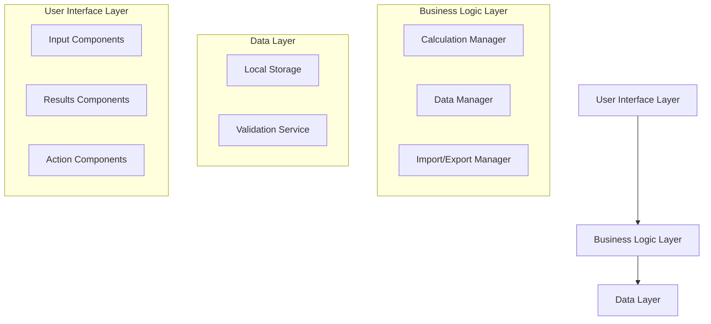

# Design Document

## Overview

The retirement calculator is a client-side web application built as a single-page application (SPA) that performs compound interest calculations for retirement planning. The application uses vanilla JavaScript/TypeScript with a modular architecture to ensure maintainability and extensibility. All data is stored locally in the browser using localStorage, with import/export functionality for data portability.

## Architecture

### High-Level Architecture



### Technology Stack

- **Frontend Framework**: Vanilla TypeScript/JavaScript (no framework dependencies)
- **Styling**: CSS3 with CSS Grid/Flexbox for responsive layout
- **Build Tool**: Vite for development and building
- **Storage**: Browser localStorage API
- **Deployment**: Static files for Cloudflare Pages

## Components and Interfaces

### Core Interfaces

```typescript
interface RetirementData {
  currentAge: number;
  retirementAge: number;
  currentSavings: number;
  monthlyContribution: number;
  expectedAnnualReturn: number;
  lastUpdated: Date;
}

interface CalculationResult {
  totalSavings: number;
  monthlyRetirementIncome: number;
  yearsToRetirement: number;
  totalContributions: number;
  interestEarned: number;
}

interface ExportData {
  version: string;
  exportDate: Date;
  userData: RetirementData;
}
```

### Component Architecture

#### 1. CalculationEngine
- **Purpose**: Core retirement calculation logic
- **Methods**:
  - `calculateFutureValue(principal, monthlyPayment, annualRate, years): number`
  - `calculateMonthlyIncome(totalSavings, withdrawalRate): number`
  - `validateInputs(data: RetirementData): ValidationResult`

#### 2. DataManager
- **Purpose**: Handle data persistence and retrieval
- **Methods**:
  - `saveData(data: RetirementData): void`
  - `loadData(): RetirementData | null`
  - `clearData(): void`

#### 3. ImportExportManager
- **Purpose**: Handle data import/export operations
- **Methods**:
  - `exportData(data: RetirementData): void`
  - `importData(file: File): Promise<RetirementData>`
  - `validateImportData(data: any): boolean`

#### 4. UIController
- **Purpose**: Coordinate between UI components and business logic
- **Methods**:
  - `updateCalculations(): void`
  - `handleInputChange(field: string, value: any): void`
  - `displayResults(results: CalculationResult): void`

## Data Models

### RetirementData Model
- Stores all user input data
- Includes validation rules for each field
- Tracks last update timestamp

### CalculationResult Model
- Contains all calculated values
- Includes intermediate calculations for transparency
- Formatted for display purposes

### Validation Rules
- Current age: 18-100 years
- Retirement age: Must be greater than current age, max 100
- Current savings: Non-negative number
- Monthly contribution: Non-negative number
- Expected return: 0-20% annual return

## Error Handling

### Input Validation
- Real-time validation with user-friendly error messages
- Prevent invalid calculations from executing
- Clear indication of which fields need correction

### Storage Errors
- Graceful degradation when localStorage is unavailable
- User notification about storage limitations
- Fallback to session-only operation

### Import/Export Errors
- File format validation with specific error messages
- Corrupted data detection and user notification
- Rollback capability for failed imports

### Calculation Errors
- Handle edge cases (zero values, extreme numbers)
- Prevent division by zero and overflow conditions
- Display appropriate warnings for unrealistic scenarios

## Testing Strategy

### Unit Testing
- Test calculation engine with various input scenarios
- Validate data persistence and retrieval functions
- Test import/export functionality with sample data
- Mock localStorage for consistent testing

### Integration Testing
- Test complete user workflows (input → calculation → display)
- Verify data flow between components
- Test error handling across component boundaries

### Browser Compatibility Testing
- Test localStorage functionality across browsers
- Verify file download/upload capabilities
- Test responsive design on different screen sizes

### Edge Case Testing
- Test with extreme values (very high/low numbers)
- Test with missing or corrupted localStorage data
- Test import with malformed JSON files
- Test calculation accuracy with compound interest edge cases

## Performance Considerations

### Calculation Optimization
- Debounce input changes to prevent excessive calculations
- Cache calculation results when inputs haven't changed
- Use efficient compound interest formulas

### Storage Optimization
- Minimize data stored in localStorage
- Compress exported JSON when possible
- Clean up old data periodically

### UI Responsiveness
- Implement progressive enhancement for slower devices
- Use CSS animations sparingly
- Optimize for mobile touch interfaces

## Security Considerations

### Data Privacy
- All data remains client-side (no server transmission)
- Clear privacy policy about local storage usage
- Option to clear all data permanently

### Input Sanitization
- Validate and sanitize all numeric inputs
- Prevent XSS through proper data handling
- Limit file upload size for imports

## Future Extensibility

### Plugin Architecture
- Design calculation engine to support additional calculators
- Modular component structure for new features
- Configuration system for different calculation types

### Potential Future Features
- Multiple retirement scenarios comparison
- Investment allocation recommendations
- Social Security integration
- Inflation adjustment calculations
- Tax consideration modules
- Goal-based planning tools

### API Readiness
- Structure data models to easily integrate with future APIs
- Design import/export to support multiple data formats
- Prepare for potential cloud sync capabilities