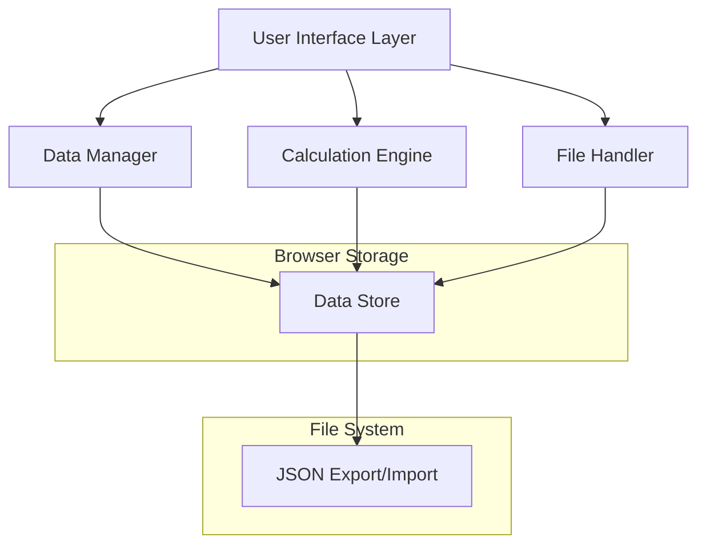

# Design Document

## Overview

The Retirement Planning Calculator is a single-page web application built with vanilla JavaScript, HTML, and CSS that operates entirely in the browser. The application uses a modular architecture with separate concerns for data management, calculations, UI rendering, and file operations. All financial data is stored in memory during the session and can be exported/imported via JSON files.

## Architecture

### High-Level Architecture



### Component Architecture

The application follows a modular design with the following core components:

1. **Data Manager**: Handles all data operations, validation, and state management
2. **Calculation Engine**: Performs all financial calculations and projections
3. **UI Controller**: Manages user interface interactions and rendering
4. **File Handler**: Manages JSON import/export operations
5. **Time Manager**: Handles date-based scheduling and time calculations

## Components and Interfaces

### Data Manager

**Purpose**: Central data store and validation layer

**Key Methods**:
- `addFinancialItem(category, item)`: Add new financial data item
- `updateFinancialItem(id, updates)`: Update existing item
- `removeFinancialItem(id)`: Remove financial item
- `getFinancialData()`: Retrieve all financial data
- `validateData(data)`: Validate data integrity

**Data Structure**:
```javascript
{
  income: [
    {
      id: "uuid",
      name: "Salary",
      amount: 5000,
      startDate: "2024-01",
      endDate: "2034-01",
      subcategories: [
        { name: "Base Salary", amount: 4500 },
        { name: "Bonus", amount: 500 }
      ]
    }
  ],
  expenses: [...],
  investments: [...],
  loans: [...],
  economicFactors: {
    inflationRate: 0.03,
    taxRate: 0.25,
    interestRate: 0.05
  },
  retirementGoals: {
    targetAge: 65,
    desiredMonthlyIncome: 4000,
    retirementDuration: 25
  }
}
```

### Calculation Engine

**Purpose**: Performs all financial calculations and projections

**Key Methods**:
- `calculateMonthlyProjections(data, timeHorizon)`: Generate month-by-month projections
- `calculateRetirementFeasibility(data)`: Determine if retirement goals are achievable
- `calculateRequiredSavings(data)`: Calculate needed monthly savings
- `applyInflation(amount, years, rate)`: Apply inflation to future values
- `calculateCompoundGrowth(principal, rate, periods)`: Calculate investment growth

**Calculation Logic**:
- Monthly cash flow = Total Income - Total Expenses - Loan Payments - Taxes
- Investment growth using compound interest formula: A = P(1 + r/n)^(nt)
- Inflation adjustment: Future Value = Present Value × (1 + inflation rate)^years
- **Monthly Expense Inflation**: Each month, expenses are adjusted by: Current Expense × (1 + monthly inflation rate)^months_elapsed
  - Monthly inflation rate = (1 + annual inflation rate)^(1/12) - 1
  - This ensures expenses grow month-by-month, compounding over time
  - Example: $3000/month expenses with 3% annual inflation becomes $3007.42 after 1 month, $3014.86 after 2 months
- **Income Inflation**: Income items can optionally be inflation-adjusted using the same monthly compounding method
- Retirement corpus needed = (Desired Monthly Income × 12 × Retirement Duration) adjusted for inflation at retirement date

### UI Controller

**Purpose**: Manages user interface and user interactions

**Key Methods**:
- `renderFinancialForm(category)`: Render input forms for financial data
- `renderProjections(calculations)`: Display calculation results
- `handleFormSubmission(formData)`: Process form inputs
- `updateDisplay()`: Refresh all UI components
- `showValidationErrors(errors)`: Display validation messages

**UI Sections**:
1. **Data Input Panel**: Tabbed interface for different financial categories
2. **Time Scheduling Panel**: Date pickers and duration inputs
3. **Results Dashboard**: Charts and projections display
4. **Import/Export Panel**: File operations interface

### File Handler

**Purpose**: Manages JSON import/export operations

**Key Methods**:
- `exportToJSON(data)`: Convert data to JSON and trigger download
- `importFromJSON(file)`: Parse JSON file and validate data
- `validateJSONStructure(jsonData)`: Ensure imported data is valid
- `generateFileName()`: Create timestamped filename for exports

### Time Manager

**Purpose**: Handles date-based calculations and scheduling

**Key Methods**:
- `parseTimeRange(startDate, endDate)`: Convert date strings to time periods
- `getActiveItemsForMonth(items, targetMonth)`: Filter items active in specific month
- `calculateMonthsBetween(startDate, endDate)`: Calculate duration in months
- `applyTimeBasedChanges(data, targetMonth)`: Apply scheduled changes for specific month

## Data Models

### Financial Item Model
```javascript
class FinancialItem {
  constructor(name, amount, startDate, endDate, subcategories = []) {
    this.id = generateUUID();
    this.name = name;
    this.amount = amount;
    this.startDate = startDate; // "YYYY-MM" format
    this.endDate = endDate;     // "YYYY-MM" format or null for indefinite
    this.subcategories = subcategories;
    this.createdAt = new Date().toISOString();
  }
  
  isActiveInMonth(targetMonth) {
    // Logic to determine if item is active in target month
  }
  
  getTotalAmount() {
    // Sum of main amount plus subcategories
  }
}
```

### Calculation Result Model
```javascript
class CalculationResult {
  constructor() {
    this.monthlyProjections = [];
    this.retirementFeasible = false;
    this.requiredMonthlySavings = 0;
    this.projectedRetirementDate = null;
    this.totalRetirementCorpus = 0;
    this.monthlyDeficit = 0;
  }
}
```

## Error Handling

### Data Validation
- **Input Validation**: Ensure all numeric inputs are valid numbers
- **Date Validation**: Verify date formats and logical date ranges
- **Range Validation**: Check that end dates are after start dates
- **Required Field Validation**: Ensure critical fields are not empty

### File Operations
- **JSON Parsing Errors**: Handle malformed JSON files gracefully
- **Schema Validation**: Verify imported data matches expected structure
- **File Size Limits**: Prevent importing excessively large files
- **Browser Compatibility**: Handle different browser file API implementations

### Calculation Errors
- **Division by Zero**: Handle edge cases in percentage calculations
- **Negative Values**: Validate that certain fields cannot be negative
- **Overflow Protection**: Handle very large numbers in long-term projections
- **Missing Data**: Provide partial calculations when some data is missing

### Error Display Strategy
- **Inline Validation**: Show field-level errors immediately
- **Summary Errors**: Display overall validation issues at form level
- **Toast Notifications**: Show success/error messages for file operations
- **Graceful Degradation**: Continue functioning with partial data when possible

## Testing Strategy

### Unit Testing
- **Data Manager Tests**: Validate CRUD operations and data integrity
- **Calculation Engine Tests**: Verify mathematical accuracy of all formulas
- **Time Manager Tests**: Test date parsing and scheduling logic
- **File Handler Tests**: Test JSON export/import functionality

### Integration Testing
- **End-to-End Workflows**: Test complete user journeys from input to results
- **Cross-Component Communication**: Verify data flow between components
- **File Round-Trip Testing**: Ensure export/import maintains data integrity
- **Browser Compatibility Testing**: Test across different browsers

### Test Data Sets
- **Minimal Data Set**: Basic income and expenses only
- **Complex Scenario**: Multiple income sources, loans, investments with time scheduling
- **Edge Cases**: Very high/low values, extreme time ranges, missing optional data
- **Invalid Data**: Test error handling with malformed inputs

### Performance Testing
- **Large Data Sets**: Test with many financial items and subcategories
- **Long-Term Projections**: Test calculations over 40+ year periods
- **Real-Time Updates**: Ensure UI remains responsive during calculations
- **Memory Usage**: Monitor browser memory consumption with large datasets

## Technical Considerations

### Browser Compatibility
- Target modern browsers (Chrome 80+, Firefox 75+, Safari 13+, Edge 80+)
- Use vanilla JavaScript ES6+ features
- Implement progressive enhancement for older browsers
- Test file download/upload across different browsers

### Performance Optimization
- Debounce calculation updates to avoid excessive recalculation
- Use efficient data structures for time-based lookups
- Implement lazy loading for complex chart rendering
- Cache calculation results when input data hasn't changed

### Security Considerations
- Client-side only application - no server-side vulnerabilities
- Validate all user inputs to prevent XSS in dynamic content
- Sanitize data before displaying in UI
- No sensitive data transmission (all local processing)

### Accessibility
- Implement ARIA labels for screen readers
- Ensure keyboard navigation for all interactive elements
- Provide high contrast mode support
- Include descriptive alt text for charts and graphs